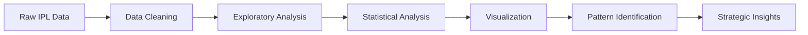

<div align="center">


<br/>


<br/>


<br/><br/>

**Project Author:** **Abhishek Kumar** &nbsp;•&nbsp; **Guide:** Mohit Sir, CETPA Infotech


</div>

---

## 📌 Overview

An end-to-end exploratory data analysis of the **Indian Premier League**, built on match-level and ball-by-ball data spanning **2008–2024**. The project turns raw cricket records into readable statistics and visual stories across eight themes: franchise dominance, batting milestones, bowling workload, Player of the Match impact, toss outcomes, venue usage, season expansion, and strategic takeaways.

<div align="center">

| 🗂️ Records | 🏟️ Venues | 👥 Players | 📅 Seasons | 📊 Visuals |
|:---:|:---:|:---:|:---:|:---:|
| Match + Ball-by-Ball | 30+ | 600+ | 17 | 8 |

</div>

---

## ✨ Headline Findings

<div align="center">

| | Area | Key Finding |
|:---:|---|---|
| 🏆 | **Franchise Performance** | Mumbai Indians lead with **144 wins**, Chennai Super Kings follow with **138** |
| 🏏 | **Run Scoring** | Virat Kohli tops the run-scorer table with **8,014 runs** |
| 🎖️ | **Match Impact** | AB de Villiers holds the most Player of the Match awards: **25** |
| 🎯 | **Bowling Workload** | Ravichandran Ashwin leads with **4,661 deliveries** bowled |
| 🪙 | **Toss Influence** | Toss winners went on to win just **50.59%** of matches |
| 🏟️ | **Venue Usage** | Eden Gardens hosted the most matches: **77** |
| 📈 | **League Growth** | Matches per season rose from **59 (2008)** to **74 (2022/2024)** |

</div>

<details>
<summary><b>🔎 Click to expand — what these numbers actually tell us</b></summary>

<br/>

- A ~6-win gap between MI and CSK across 17 seasons is **statistically thin** — both franchises are effectively co-dominant, not one clearly ahead.
- Kohli's 8,014 runs represent longevity as much as peak scoring; volume leaders are usually anchor batters with uninterrupted season presence.
- Ashwin's delivery count is a **workload** metric, not an economy or wicket metric — high deliveries signal trust from captains across powerplay and middle overs.
- A 50.59% toss-win-to-match-win rate is barely distinguishable from a coin flip, which is the single most counterintuitive result in the project.

</details>

---

## 📊 Visual Summary

<div align="center">

<br/>
<sub><i>Animated recreation of the franchise-win comparison presented in the project.</i></sub>
</div>

### Franchise Wins at a Glance

```text
Mumbai Indians        ████████████████████████████████████████  144
Chennai Super Kings   ██████████████████████████████████████    138
Other Franchises      ▓▓▓▓▓▓▓▓▓▓▓▓▓▓▓▓▓▓▓▓▓▓▓▓▓▓▓▓              ...
```

---

## 🖼️ Presentation Gallery

<table>
<tr>
<td width="50%" align="center">
<b>Dataset Overview</b><br/>

</td>
<td width="50%" align="center">
<b>Most Successful Franchises</b><br/>

</td>
</tr>
<tr>
<td width="50%" align="center">
<b>All-Time Leading Run Scorers</b><br/>

</td>
<td width="50%" align="center">
<b>Match-Winning Impact Leaders</b><br/>

</td>
</tr>
<tr>
<td width="50%" align="center">
<b>Bowling &amp; Delivery Leaders</b><br/>

</td>
<td width="50%" align="center">
<b>Toss Winner vs Match Winner</b><br/>

</td>
</tr>
<tr>
<td width="50%" align="center">
<b>Top IPL Venues</b><br/>

</td>
<td width="50%" align="center">
<b>Matches per Season</b><br/>

</td>
</tr>
</table>

---

## 🔍 Analysis Modules

<details open>
<summary><b>1️⃣ Dataset Overview &amp; Processing</b></summary>

- Match-level IPL data (`matches.csv`)
- Ball-by-ball delivery data (`deliveries.csv`)
- Cleaning, type coercion, null handling and validation
- Core fields: match ID, player, team, venue, toss outcome, result

</details>

<details>
<summary><b>2️⃣ Team Performance</b></summary>

Franchises are compared on historical match wins across the analyzed period to surface the most consistently successful sides.

</details>

<details>
<summary><b>3️⃣ Player Performance</b></summary>

- Leading run scorers
- Bowling workload (deliveries bowled)
- Wicket-taking performance
- Player of the Match award distribution

</details>

<details>
<summary><b>4️⃣ Toss Impact</b></summary>

Toss winners are cross-tabulated against eventual match winners. The result — **50.59%** — points to only a marginal association between winning the toss and winning the game.

</details>

<details>
<summary><b>5️⃣ Venue Analysis</b></summary>

Venues ranked by matches hosted, with **Eden Gardens** at the top of the table at 77 matches.

</details>

<details>
<summary><b>6️⃣ Season Trends</b></summary>

Season-level match counts visualized to trace how the league's schedule expanded and fluctuated between 2008 and 2024.

</details>

---

## 💡 Strategic Takeaways

> **Franchise Consistency** — Mumbai Indians and Chennai Super Kings demonstrate sustained historical success rather than one-off peaks.

> **Anchor Batting Value** — Volume scorers like Virat Kohli and Shikhar Dhawan generate substantial long-term batting value for their sides.

> **Toss Neutrality** — Winning the toss alone does not decide matches; execution and conditions carry far more weight.

> **Individual Impact** — Player of the Match awards offer a second, independent lens for identifying high-impact performers.

---

## 🛠️ Tech Stack

```text
Python 3.9+
├── NumPy        → numerical operations
├── Pandas       → data loading, cleaning, aggregation
├── Matplotlib   → base plotting layer
└── Seaborn      → statistical visualizations

Jupyter Notebook → interactive analysis environment
```

---

## 📈 Analytical Workflow



---

## 📁 Project Structure

```text
IPL-Data-Analysis/
│
├── data/
│   ├── matches.csv
│   └── deliveries.csv
│
├── notebooks/
│   └── IPL_Cricket_Data_Analysis.ipynb
│
├── assets/
│   ├── animated-title.gif
│   ├── animated-bars.gif
│   ├── cover.png
│   ├── dataset-overview.png
│   ├── franchise-wins.png
│   ├── run-scorers.png
│   ├── match-winners.png
│   ├── bowling-leaders.png
│   ├── toss-analysis.png
│   ├── venue-analysis.png
│   ├── season-trends.png
│   └── key-takeaways.png
│
├── README.md
└── requirements.txt
```

---

## 🚀 Quick Start

```bash
# 1. Clone the repository
git clone <your-repository-url>
cd IPL-Data-Analysis

# 2. (Optional) create a virtual environment
python -m venv venv
source venv/bin/activate      # Windows: venv\Scripts\activate

# 3. Install dependencies
pip install -r requirements.txt

# 4. Launch the notebook
jupyter notebook
```

Then open `notebooks/IPL_Cricket_Data_Analysis.ipynb` and run the cells in order.

<details>
<summary><b>📦 requirements.txt</b></summary>

```txt
numpy
pandas
matplotlib
seaborn
jupyter
```

</details>

---

## 📋 Data Quality Notes

This project combines **match-level** and **ball-by-ball** sources. Reported figures should be read against the specific table used for each metric rather than assuming a single shared row-level source. Franchise rebrands (e.g. Delhi Daredevils → Delhi Capitals, Kings XI Punjab → Punjab Kings) affect win-count aggregation and should be normalized before drawing long-run conclusions.

---

## 🎓 Learning Outcomes

<div align="center">

| Skill | Applied In |
|---|---|
| Data loading &amp; cleaning | Raw CSV ingestion and validation |
| Pandas manipulation | Filtering, merging, reshaping |
| NumPy analysis | Numerical summaries and rates |
| Grouping &amp; aggregation | Team, player and venue rollups |
| Statistical summaries | Toss-win rate, season distributions |
| Data visualization | Eight themed chart sets |
| Domain exploration | Cricket-specific metric design |
| Insight generation | Translating charts into takeaways |
| Notebook workflow | Reproducible, cell-ordered analysis |

</div>

---

## 👨‍💻 Author

<div align="center">

**Abhishek Kumar**

*Project Guide:* **Mohit Sir** — CETPA Infotech

<br/>

⭐ *If this project helped or interested you, consider starring the repository.*

</div>

---

<div align="center">
<sub>Built with Python, Pandas and a lot of cricket. Replace the placeholder repository URL and add your original dataset source before publishing.</sub>
</div>
